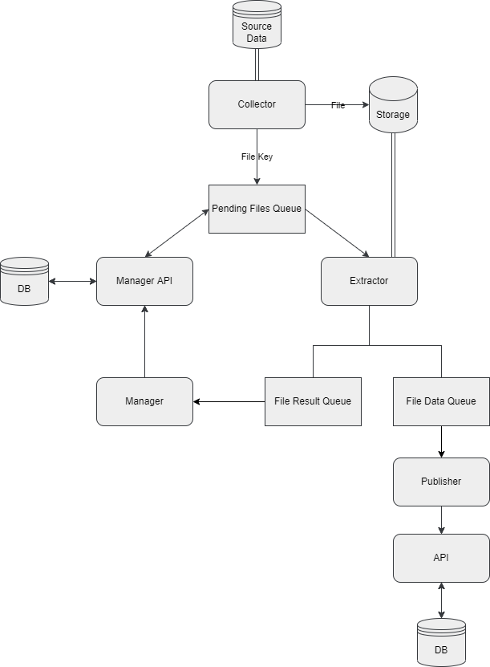

# Go File Collector

<p align="center">Micro serviço para coleta de arquivos e envio para um storage</p>

<p align="center">


</p>

## Tabela de conteúdos

- [Go File Collector](#go-file-collector)
  - [Tabela de conteúdos](#tabela-de-conteúdos)
    - [Projeto](#projeto)
    - [Collector](#collector)
    - [Configuração](#variaveis-de-ambiente)
    - [Rodando a aplicação](#rodando-a-aplicação)
    - [TODO's](#todos)
    - [Licença](#licença)
    - [Contato](#contato)

## Projeto

A ideia do projeto como um todo é criar um serviço de ETL como descrito abaixo:



# Collector

O collector é o serviço que é responsavél por coletar os arquivos de uma fonte, envia-los para um storage e disparar um evento para um message broker indicando que o arquivo está pendente e disponível para ser processado.
A aplicação também conta com o Jaeger para colectar metricas de opentelemetry, para habilitar é só exportar a variavel de ambiente `TRACE_ENABLE=true`

- Servidor de arquivos
  - Máquina local
  - Servidor SFTP

- Storage
  - S3

- Broker
  - RabbitMQ
  - SQS

## Variaveis de ambiente

```conf
# Configuraçãos do tracer para enviar as informações do opentelemetry
# O setup do projeto é feit com o Jaeger
TRACE_URL=http://localhost:14268
TRACE_SERVICE_NAME=go-collector

# Broker
BROKER_URL=localhost
BROKER_PORT=5672
BROKER_USER=guest
BROKER_PASSWORD=guest

# Storage
STORAGE_HOST=http://localhost.localstack.cloud:4566
STORAGE_BUCKET=collector-files

# Logger
# Por default, o log no console é habilitado, caso queira desabilitar é só exposrtar a variavel de ambiente
LOG_CONSOLE_JSON=true
LOG_CONSOLE_LEVEL=debug
LOG_CONSOLE_ENABLED=true

# Os logs em arquivos são desabilitados por default, para habilitar é só exportar a variavel de ambiente
LOG_FILE_ENABLED=false
LOG_FILE_LEVEL=info
LOG_FILE_JSON=true

# Pasta para o output dos logs
LOG_FILE_DIR=./logs
# Nome base do arquivo de log
LOG_FILENAME=collector.logs
# Tamanho máximo de cada arquivo de log em MB
LOG_MAX_SIZE=1
# Máximo arquivos de log que devem ser mantidos
LOG_MAX_BACKUPS=7
# Quantidade máxima de dias antes de rotacionar o arquivo de log
LOG_MAX_AGE=1


# File Server
# Configurações do servidor de arquivos
# Caso utilize o LocalFileServer, todas as configurações serão ignoradas.
FILE_SERVER_URL=localhost:22
FILE_SERVER_USER=admin
FILE_SERVER_PASSWORD=secret
FILE_SERVER_PRIVATE_KEY=
FILE_SERVER_KEY_EXCHANGES=
```

## Configurando a coleta de arquivos

A configuração da coleta de arquivos é feita através do arquivo config.yaml, que contem a seguinte estrutura

```yaml
sender:
  - collect:  # Serviço que irá fazer a coleta dos arquivos, pode conter quantos quiser
      pattern:  # Array de quais patterns ele deve usar para coletar os arquivos, diretorios serão ignorados
        - ./data/*.json
      maxFilesBatch: 5  # Quantidade máxima de arquivos para enviar vez, caso seja 0 envia todos os arquivos
      delay: 1  # Tempo de espera em segundos entre uma coleta e outra
    workers: 1  # Quantidade de Workers para fazer o Upload dos arquivos para o Storage

```

## 🎲 Rodando a aplicação

Para executar a aplicação é bem simples, depois de configurar tudo é só executar o comando

```bash
make run
```

## Dependencias externas

O repositório conta com um arquivo `docker-compose.yaml` que contem todas as dependencias externas necessárias para rodar o serviço localmente, você pode inicia-las com o comando:

```bash
# Inicia os containers
make setup

# Para os containers
make setdown
```

### 🎲 Contribuindo com o projeto

```bash
# Clone este repositório
$ git clone <https://github.com/uesleicarvalhoo/go-collector-service>

# Acesse a pasta do projeto no terminal/cmd
$ cd go-collector-service

# Inicie as dependencias do projeto
$ make setup

# Instale as dependências
$ go mod install

# Copie o arquivo .env.example para .env e altere as configurações das variaveis para as suas configurações
$ cp .env.example .env

# Faça suas alterações

# Formate o código
$ make format

# Garanta que os testes estão passando
$ make test

# Abra uma pull request e ela será analisada
```

### TODO's

- [ ] Implementar o envio para o BlobStorage
- [ ] Implementar testes para as dependencias externas
- [ ] Configurar a escolha das dependencias externas de forma dinâmica, message broker, storage e file sever

### Licença

Este projeto está licenciado nos termos da licença MIT, para mais detalhes consulte o arquivo LICENSE.

### Contato

Olá, sou Ueslei Carvalho 👋🏻 criador e mantenedor deste projeto. Caso queira entrar em contato comigo, fique a vontade para utilizar qualquer um dos canais abaixo! :)

<https://www.linkedin.com/in/uesleicarvalhoo/>

📧 uesleicdoliveira@gmail.com

📷 <https://www.instagram.com/uesleicarvalhoo/>
